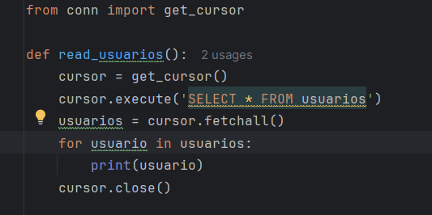

Aquí creo un método que inserta un nuevo usuario con los datos (nombre, apellido, email, descripción y sueldo) en la tabla usuarios de la base de datos.

Método que elimina la tabla usuarios si ya existe y lugo crea una nueva tabla usuarios con las columnas id, nombre, apellido, email, descripcion y sueldo en la base de datos.

Este método elimina un usuario por su ID que luego devuelve un mensaje de confirmación a la hora de realizarse correctamente.

Aquí leemos los usuarios que hay en la tabla y los imprime uno por uno.

Actualizamos la descripción y/o el salario de un usuario en la tabla de usuarios según el usuario_id que hayamos escrito.

Y estos son los ajustes del docker y el contenedor.

